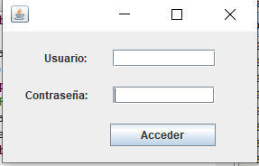

# Control acceso mediante usuario y contraseña

*Se desarollo un programa el cual se necesita un usuario y contraseña para poder administrar el acceso de los alumnos y que estos puedan elegir que materia tomar(funcion adicional agregada por parte de Valtierra Lopez Carlos Andres).*

*1.- Contiene una ventana en donde se solicita el usuario y la contraseña para poder acceder a las funciones del programa y esta conectado a SQL para poder trabajarlo, ya que se necesito de una base de datos, la cual, use SQL para poder trabajarlo.*

*2.- En caso de no tenerlo conectado a nuestra base de datos, no se puede trabajar con la aplicacion y mandara error al momento de ingresar nuestras credenciales.*

*3.- Tiene la funcion de dar de baja y de alta materias al igual que usuarios.*

# Pre-requisitos 📋

*Se necesita tener instalado y configurado previamente SQL para poder acceder a la aplicacion.*

# Elementos visuales y funcionamiento.

*1.- Dos JLabel, uno que muestra Usuario y el otro Contraseña.*

*2.- Un JTextField para poder introducir nuestras licencias.*

*3.- Un JPassword para cubrir nuestra contraseña con * y que no sea revelada.*

*4.- Un JButton para poder acceder con los datos insertados.*

# Librerias.
import java.awt.EventQueue; 

import java.awt.event.ActionEvent;

import java.awt.event.ActionListener;

import java.sql.Connection;

import java.sql.DriverManager;

import java.sql.ResultSet;

import java.sql.SQLException;

import java.sql.Statement;

import java.util.logging.Level;

import java.util.logging.Logger;

import javax.swing.JFrame;

import javax.swing.JLabel;

import javax.swing.JTextField;

import javax.swing.JButton;

import javax.swing.JPasswordField;

# Agradecimientos. 

 *A nuestro docente por alentarnos y a mi por esforzarme.*
 
 # Referencias.
 
 *https://classroom.google.com/u/0/c/MTIxOTQ5MjU4MDA0/a/MTIxOTczNzM5ODU0/details?hl=es*
 *https://docs.oracle.com/javase/7/docs/api/javax/swing/JPasswordField.html*
 
 # Resultados.

 
